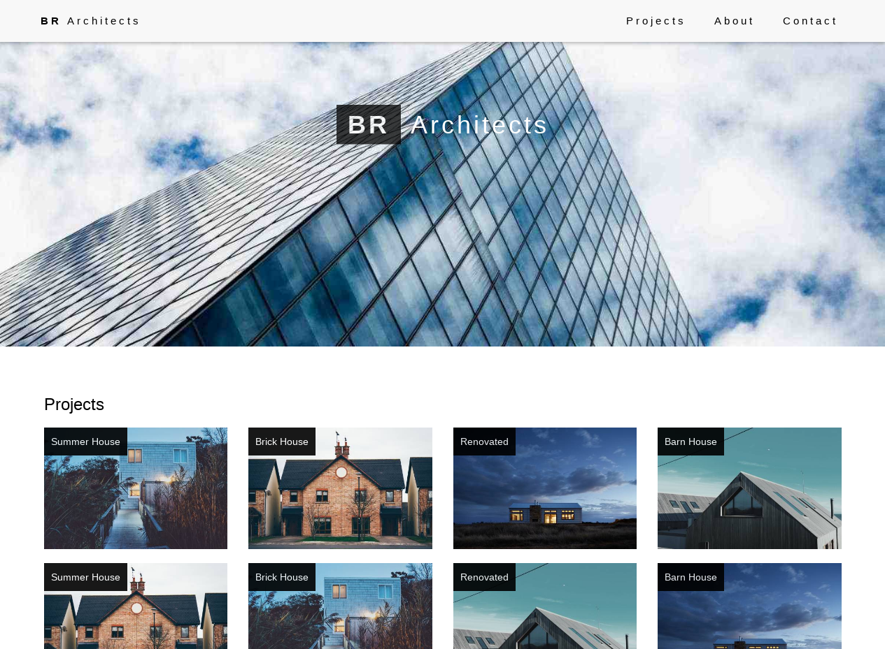

# engelpain.github.io
<a href="https://engelpain.github.io/">
  
Guía para crear una página de un repositorio GitHub

  
</a>
<a href="https://engelpain.github.io/architect">
  
Plantilla para Arquitectos

  
</a>